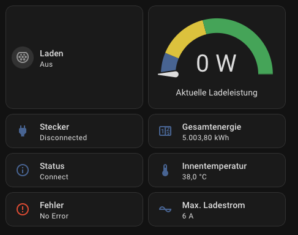

# Besen Wallbox WiFi (UDP) — Home Assistant Addon

Dieses Addon verbindet die **Besen BS20 Wallbox** mit Home Assistant über WiFi (UDP) oder Bluetooth (BLE) und stellt alle Sensoren und Steuerungen automatisch per **MQTT Discovery** bereit.

---

## Ziel

Die Besen BS20 Wallbox kommuniziert über ein proprietäres Binärprotokoll — entweder per Bluetooth oder über UDP-Broadcasts im lokalen Netzwerk. Dieses Addon lauscht auf diese UDP-Broadcasts, authentifiziert sich bei der Wallbox und veröffentlicht alle Daten in Home Assistant via MQTT.

**Kein Cloud-Zugang, keine App-Abhängigkeit** — die Wallbox wird vollständig lokal gesteuert.

---

## Wie es funktioniert

Die Wallbox sendet alle ~3 Sekunden einen **UDP-Broadcast** (Port `28376`) ins lokale Netzwerk. Das Addon:

1. Lauscht auf UDP-Port `28376`
2. Erkennt die Wallbox automatisch anhand des Broadcasts (keine IP-Konfiguration nötig)
3. Authentifiziert sich mit dem Geräte-PIN
4. Empfängt Lade- und Statusdaten
5. Veröffentlicht alles in Home Assistant via MQTT Discovery

---

## Installation

### 1. Addon-Repository in Home Assistant hinzufügen

1. **Einstellungen → Addons → Addon Store** öffnen
2. Oben rechts auf **⋮ → Custom repositories** klicken
3. URL eintragen:
   ```
   https://github.com/david120378/evsemqtt-ha
   ```
4. **Hinzufügen** klicken — das Addon erscheint danach im Store

### 2. Voraussetzungen

- **Mosquitto MQTT Broker** Addon muss installiert und gestartet sein
  (`Einstellungen → Addons → Mosquitto broker`)
- Die Wallbox muss mit dem **gleichen WLAN** verbunden sein wie der Home Assistant Host
- Der HA-Host und die Wallbox müssen im **gleichen Subnetz** liegen (damit UDP-Broadcasts ankommen)

### 3. Addon installieren und konfigurieren

1. Addon im Store suchen: **„Besen Wallbox WiFi (UDP)"**
2. **Installieren**
3. **Konfiguration** öffnen und folgende Felder ausfüllen:

---

## Konfiguration

| Option | Beschreibung | Standard |
|--------|-------------|---------|
| `WIFI_ENABLED` | `true` für WiFi-Modus (UDP), `false` für BLE | `false` |
| `WIFI_PORT` | UDP-Port auf dem die Wallbox Broadcasts sendet | `28376` |
| `WIFI_IP` | Optionale statische IP der Wallbox (verbessert Reconnect-Zuverlässigkeit) | — |
| `BLE_ADDRESS` | MAC-Adresse der Wallbox (nur BLE-Modus) | — |
| `BLE_PASSWORD` | 6-stelliger PIN der Wallbox | `123456` |
| `UNIT` | Einheit für Leistungsanzeige: `W` oder `kW` | `W` |
| `MQTT_BROKER` | Hostname des MQTT-Brokers | `core-mosquitto` |
| `MQTT_PORT` | Port des MQTT-Brokers | `1883` |
| `MQTT_USER` | MQTT-Benutzername | — |
| `MQTT_PASSWORD` | MQTT-Passwort | — |
| `LOGGING_LEVEL` | Log-Verbosität: `DEBUG`, `INFO`, `WARNING`, `ERROR` | `INFO` |
| `SYS_MODULE_TO_RELOAD` | Bluetooth-Kernelmodul bei Crash neu laden (BLE) | — |

### Minimale WiFi-Konfiguration

```yaml
WIFI_ENABLED: true
BLE_PASSWORD: "123456"   # dein Wallbox-PIN
MQTT_BROKER: core-mosquitto
MQTT_USER: dein_mqtt_user
MQTT_PASSWORD: dein_mqtt_passwort
```

> **Hinweis:** Im WiFi-Modus wird keine IP-Adresse der Wallbox benötigt — sie wird automatisch per UDP-Broadcast erkannt.

---

## Dashboard-Karte

Die fertige Lovelace-Karte liegt in [`dashboard/wallbox_card.yaml`](dashboard/wallbox_card.yaml) und kann direkt in ein bestehendes Dashboard eingebettet werden.

### Vorschau



### Inhalt der Karte

Die Karte ist zweispaltig aufgebaut:

| Linke Spalte | Rechte Spalte |
|---|---|
| Laden (Schalter) | Ladeleistung (Gauge 0–11 kW) |
| Stecker-Status & Fahrzeugstatus | Gesamtenergie & Innentemperatur |
| Fehler & Meldung | Max. Ladestrom (einstellbar) |

Der Gauge zeigt die Ladeleistung farbkodiert: **blau** = kein Laden, **gelb** = einphasig, **grün** = dreiphasig.

### Einbinden

1. Dashboard-Editor öffnen → **Karte hinzufügen** → **Manuell**
2. Inhalt von [`dashboard/wallbox_card.yaml`](dashboard/wallbox_card.yaml) einfügen
3. Falls nötig: `wallbox_evse_bs20` durch das eigene Entity-Präfix ersetzen
   (zu finden unter **Einstellungen → Geräte & Dienste → MQTT → deine Wallbox**)

---

## Home Assistant Integration

Sobald das Addon läuft und die Wallbox erkannt wurde, erscheint unter
**Einstellungen → Geräte & Dienste → MQTT** ein neues Gerät mit allen Entitäten:

**Sensoren:**
- Aktuelle Ladeleistung (W / kW)
- Spannung und Strom pro Phase
- Gesamtenergie der aktuellen Session
- Innen- und Außentemperatur
- Lade- und Verbindungsstatus
- Fehlerzustand

**Steuerungen:**
- Laden starten / stoppen
- Maximale Stromstärke setzen
- Gerätename, Sprache, Temperatureinheit

---

## Troubleshooting

**Wallbox wird nicht erkannt**
- Prüfen ob HA-Host und Wallbox im gleichen Subnetz sind
- UDP-Broadcasts mit tcpdump prüfen: `sudo tcpdump -n -i en0 src host <wallbox-ip> and udp`
- `LOGGING_LEVEL` auf `DEBUG` setzen

**Authentifizierung schlägt fehl**
- `BLE_PASSWORD` prüfen (6-stelliger PIN, Standard `123456`)

**BLE-Adapter stürzt ab**
- `SYS_MODULE_TO_RELOAD` auf `btusb` (USB-Dongle) oder `hci_uart` (Raspberry Pi) setzen

---

## Technische Details

- Protokoll: proprietäres Binärformat (`0x0601` Header, `0x0f02` Tail)
- Transport WiFi: UDP-Broadcast, Port `28376`, Auto-Discovery
- Transport BLE: GATT Notifications (bleak)
- Basiert auf: [slespersen/evseMQTT](https://github.com/slespersen/evseMQTT)

---

## Changelog

### v0.1.16 — 2026-04-15
**Fix: Addon-URL auf korrektes Repository gesetzt**

Der „Änderungsprotokoll"-Link im HA-Addon-UI verwies auf das falsche Repository (`slespersen/evseMQTT`). URL in `config.yaml` auf `https://github.com/david120378/evsemqtt-ha` korrigiert.

### v0.1.15 — 2026-04-15
**Bugfix: Fehlerbehandlung für fehlerhafte/zu kurze Pakete**

Empfängt die Wallbox ein fehlerhaftes oder zu kurzes UDP-Paket (z. B. `system_time`-Paket mit weniger als 5 Bytes), crashte der `system_time`-Parser mit `IndexError: bytearray index out of range`. Die Exception wurde von asyncio still geschluckt (`Task exception was never retrieved`) und tauchte nur im Log auf.

Zwei Fixes:
- **`parsers.py` – `system_time`**: Explizite Längenprüfung (`len(data) < 5 → return {}`) bevor auf die Bytes zugegriffen wird.
- **`event_handlers.py` – `handle_notification`**: Zentrales `try/except` um alle Parser-Aufrufe — fängt künftige Parser-Fehler aller Handler ab, loggt sie als `WARNING` mit Cmd-ID und Datenlänge, und bricht den Task sauber ab statt ihn crashen zu lassen.

### v0.1.14 — 2026-03-26
**Verbesserung: `expire_after` für Lade-Topic-Entitäten**

Entitäten auf dem `state/charge`-Topic erhalten jetzt `expire_after=90`. HA markiert sie automatisch als nicht verfügbar, wenn innerhalb von 90 s keine MQTT-Nachricht eintrifft — also immer dann, wenn die Wallbox ihre UDP-Session verliert — ohne dass das Addon explizit eine „offline"-Availability-Nachricht veröffentlichen muss.

Die Watchdog-Automation kann damit einen einfachen State-Trigger (`to: unavailable, for: 5 min`) nutzen, anstatt das fragile `last_updated`-Template, das alle 5–10 Minuten falsche Neustarts verursacht hat.

### v0.1.13 — 2026-03-24
**Bugfix: `config_topic` aus MQTT-Discovery-Payload entfernt**

Das interne Feld `config_topic` wurde fälschlicherweise in den Discovery-Payload publiziert. HA 2026.3.4 lehnt Discovery-Payloads mit unbekannten Feldern für strikte Plattformen (switch, number, text, select) ab — betroffene Entitäten wurden nie abonniert und blieben dauerhaft nicht verfügbar. Numerische Sensor-Plattformen waren toleranter, weshalb nur diese funktionierten.

Fix: `config_topic` wird vor dem Publizieren aus dem Discovery-Dict entfernt.

### v0.1.12 — 2026-03-24
**Bugfix: Seriell-basierter Geräteidentifier wenn MAC nicht verfügbar**

Im WiFi-Modus wird `--address` nicht übergeben, sodass `Device._mac` immer leer ist. Wenn Session Recovery die Login-Beacon-Phase (cmd=1) überspringt, bleibt die echte MAC unbekannt und MQTTPayloads publiziert `identifiers:[""]`. Jeder Neustart erzeugte einen anderen effektiven Identifier und verwaiste HA-Entitäten.

Fix: Fallback auf `identifiers:["evsemqtt_{serial}"]` wenn MAC leer ist. Der Serial ist immer verfügbar (nach dem ersten Connect auf Disk gecacht). BLE-Modus ist nicht betroffen.

### v0.1.11 — 2026-03-24
**Bugfix: Vollständige Geräteinformationen cachen für stabilen MQTT-Identifier**

Ursache für „Sensoren nicht verfügbar": Im WiFi-Modus sind mac/model/manufacturer/phases/output_max_amps nach Session Recovery via Heartbeat (cmd=3) nie befüllt. MQTTPayloads publiziert dann `identifiers:[""]` — HA erstellt ein anderes Gerät als beim ersten Start und verwaist alle Entitäten.

Fix:
- **`wifi_manager`**: `/data/last_wallbox_device.json`-Cache für mac, model, manufacturer, phases, output_max_amps; neue Methode `record_device_info()`.
- **`event_handlers`**: `record_device_info()` nach cmd=1 (Login-Beacon) aufrufen, damit echte MAC und Modell nach dem ersten erfolgreichen Connect persistiert werden.
- **`main.py`**: Beim Start gecachte Geräteinformationen in das Device-Objekt laden, bevor MQTTPayloads erstellt wird — für stabilen MAC-basierten Identifier auch wenn cmd=1 übersprungen wird.

### v0.1.10 — 2026-03-24
**Verbesserung: MQTT-Availability online/offline bei Wallbox-Connect/-Disconnect**

Bisher wurde `publish_availability("online")` nur einmal beim initialen Start aufgerufen, und „offline" wurde gar nicht publiziert. Nach einem Wallbox-Reconnect (Session Recovery) oder nach dem Watchdog-Reset von `initialization_state` blieben HA-Entitäten dauerhaft nicht verfügbar.

Die `_run_wifi`-Idle-Schleife verfolgt jetzt `initialization_state` und publiziert „online"/„offline" auf das Availability-Topic, sobald sich der Zustand ändert — HA-Entitäts-Availability bleibt damit synchron zum tatsächlichen Verbindungsstatus.

### v0.1.9 — 2026-03-24
**Verbesserung: Serial sofort persistieren; Log-Rauschen reduzieren**

- **`wifi_manager`**: Neue öffentliche Methode `record_serial()`, die den Serial sofort in `/data/last_wallbox_serial.txt` speichert — ab dem ersten erfolgreichen Connect verfügbar für LOGIN_REQUEST-Wakeups.
- **`event_handlers`**: `record_serial()` nach cmd=2 (Login-Bestätigung) und nach cmd=3 (Session Recovery) aufrufen.
- **`main.py`**: „Device not initialized yet, waiting..." und „Waiting for software version..." von INFO auf DEBUG heruntergestuft, um Log-Rauschen bei normalen Logging-Levels zu reduzieren.

### v0.1.8 — 2026-03-24
**Verbesserung: Reconnect/Wakeup-Log-Meldungen auf WARNING hochgestuft**

Alle Wakeup- und Reconnect-Meldungen wurden auf INFO-Level geloggt und waren bei `LOGGING_LEVEL=WARNING` (Standard für die meisten Nutzer) unsichtbar. Durch Hochstufung auf WARNING erscheinen sie immer im HA-Addon-Log und Verbindungsprobleme sind sofort erkennbar — ohne den Logging-Level ändern zu müssen.

### v0.1.7 — 2026-03-24
**Verbesserung: Echten LOGIN_REQUEST als Wakeup senden wenn Wallbox komplett still ist**

Das all-FF-Broadcast-Wakeup-Paket war wirkungslos, wenn die Wallbox komplett aufgehört hatte zu senden (keine Heartbeats, keine Beacons). Die Wallbox-App weckt die Wallbox zuverlässig durch Senden eines richtigen LOGIN_REQUEST mit der echten Seriennummer direkt an die Wallbox-IP.

Änderungen:
- **`wifi_manager`**: Serial der Wallbox wird in `/data/last_wallbox_serial.txt` gecacht (gleiches Muster wie IP-Cache). Serial wird in `_send_wakeup()` opportunistisch persistiert.
- **`wifi_manager`**: `_send_wakeup()` sendet jetzt als drittes Paket einen echten LOGIN_REQUEST (cmd=32770) mit `Utils.build_command(serial, password)` an die letzte bekannte IP und den Source-Port. Fällt graceful zurück wenn Serial noch nicht bekannt.
- **`event_handlers`**: Im cmd=2-Handler (LOGIN_RESPONSE) wird `initialization_state=True` gesetzt wenn Serial bekannt, aber Flag noch False — für den Fall dass die Wallbox via direktem LOGIN_REQUEST geweckt wurde ohne vorherigen Login-Beacon-Flow.

### v0.1.6 — 2026-03-23
**Bugfix: Automatischer Reconnect ohne App-Eingriff**

Nach einem HA-Neustart oder einem kurzzeitigen Verbindungsabbruch sendete die Wallbox weiterhin **Heartbeat-Pakete** (statt neue Login-Beacons) — da sie die Session noch als aktiv betrachtete. Das Addon ignorierte diese Heartbeats, weil `initialization_state = False` war. Die Wallbox wartete vergeblich auf eine Antwort, timeout-te schließlich und hörte ganz auf zu senden. Danach half nur noch das Öffnen der App.

Zwei Fixes:
- **Session Recovery via Heartbeat**: Empfängt das Addon einen Heartbeat (cmd=3) ohne initialisiert zu sein, extrahiert es den Serial aus dem Paket-Header, stellt den Geräte-State wieder her (`initialization_state=True`, `logged_in=True`), beantwortet den Heartbeat sofort und fragt die Konfiguration neu ab — ohne den vollen Login-Beacon-Flow.
- **`software_version` Reset bei Timeout**: Beim Reconnect-Watchdog wurde `software_version` nicht zurückgesetzt, was den Login-Flow nach einem Timeout blockiert hat.

### v0.1.5 — 2026-03-23
**Bugfix: Wakeup-Paket-Prüfsumme korrigiert + Wallbox-Source-Port versuchen**

Eigentliche Ursache für Reconnect-Fehlschläge: `_WAKEUP_PACKET` hatte Prüfsumme `0x0E14`, korrekt ist aber `0x0E13` (Summe aller vorangehenden Bytes % 0xFFFF = 3603). Die Wallbox hat jeden Wakeup still verworfen, weil die Prüfsummenvalidierung fehlschlug.

Änderungen:
- Hardcodiertes `_WAKEUP_PACKET` durch `_build_wakeup_packet()` ersetzt, das die Prüfsumme dynamisch berechnet — verhindert diese Klasse von Bugs in Zukunft.
- `last_known_port` (der ephemere UDP-Source-Port der Wallbox, z. B. 36419) wird beim ersten Connect gespeichert, sodass Wakeup-Pakete auch an diesen Port gesendet werden — nicht nur an `self.port` (28376).
- `_send_wakeup` versucht jetzt beide Ports × beide Adressen (Broadcast + Unicast), also vier Versuche pro Wakeup-Zyklus.

### v0.1.4 — 2026-03-13
**Verbesserung: Robusterer Reconnect-Mechanismus im WiFi-Modus**

Wenn die Wallbox kurzzeitig aufhört, UDP-Broadcasts zu senden (z. B. nach einem Stromausfall oder App-Zugriff), reichte der bisherige Broadcast-Wakeup (`255.255.255.255`) allein nicht immer aus — insbesondere wenn die Wallbox zwar erreichbar, aber im Broadcast-"Schlaf" war.

Neue Funktionen:
- **IP-Caching**: Die zuletzt gesehene Wallbox-IP wird in `/data/last_wallbox_ip.txt` gespeichert und nach einem Add-on-Neustart sofort für direkten Wakeup genutzt.
- **Direkter Unicast-Wakeup**: Wakeup-Pakete werden jetzt an Broadcast UND an die bekannte/konfigurierte Wallbox-IP gesendet, was die Reconnect-Zuverlässigkeit deutlich verbessert.
- **Schnellere Retry-Schleife**: Nach einem Verbindungsabbruch werden Wakeup-Pakete alle 10 Sekunden wiederholt (statt alle 35 Sekunden).
- **Neues Konfigurations-Feld `WIFI_IP`**: Optionale statische IP der Wallbox — nützlich wenn DHCP-Adressänderungen vorkommen.

### v0.1.3 — 2026-03-08
**Bugfix: Stabilitätsproblem bei eingehenden MQTT-Kommandos im WiFi-Modus behoben**

Im WiFi-Modus konnte das Addon abstürzen, wenn ein MQTT-Kommando (z. B. Laden starten/stoppen) eintraf, während die UDP-Verbindung zur Wallbox kurzzeitig unterbrochen war. Ursache war die Verwendung von `asyncio.run()` im MQTT-Callback, das bei jedem Aufruf einen neuen Event Loop erzeugt — inkompatibel mit der `asyncio.Queue`, die an den Haupt-Event-Loop gebunden ist.

Fix: `asyncio.run()` ersetzt durch `asyncio.run_coroutine_threadsafe()`, das Coroutinen thread-sicher in den laufenden Haupt-Event-Loop einreiht. Zusätzlich wird die Queue jetzt innerhalb von `serve()` initialisiert, um sicherzustellen, dass sie immer im richtigen Loop-Kontext erstellt wird.

### v0.1.2 — 2026-03-06
Reconnect-Watchdog direkt beim Start von `serve()` aktiviert.

### v0.1.1 — 2026-03-05
Wakeup-Broadcast bei Verbindungsabbruch statt Prozess-Neustart.

### v0.1.0 — 2026-03-01
Erstes stabiles Release.
